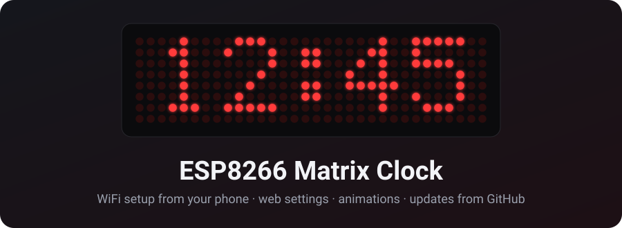
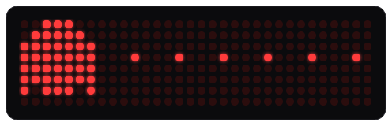
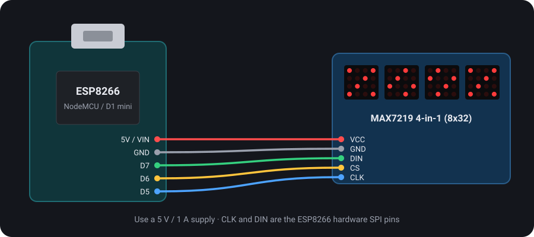
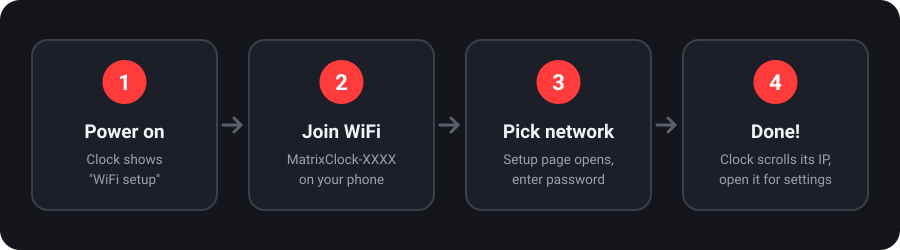

<p align="center">
  
</p>

<p align="center">
  <a href="https://github.com/ElectroIoT/ESP8266-Matrix-Clock/releases/latest"></a>
  
  
  
  <a href="https://github.com/ElectroIoT/ESP8266-Matrix-Clock/actions/workflows/build.yml"></a>
  <a href="LICENSE"></a>
</p>

<p align="center">
  <b>A WiFi LED-matrix clock you set up entirely from your phone.</b><br>
  ESP8266 + 4-in-1 MAX7219 (8x32). No code editing and no WiFi passwords in the firmware.
</p>

---

## ✨ Features

<table>
<tr>
<td width="50%" valign="top">

**🕒 Clock**
- Internet time (NTP), India (IST) by default, 14 time zones to pick from
- 12 or 24 hour, blinking colon, seconds bar
- Scrolling date once a minute
- **8 digit animations:** Roll down, Roll up, Dissolve, Slide, Flip, Drop & bounce, Random, Instant

**🎆 Effects**
- Sparkle, Wipe, Rain, Boxes and **Pac-Man**
- Every hour and/or at power-on, with try-out buttons

**💬 Messages**
- Custom scrolling message: once, or every 1 to 60 minutes
- **Special days:** birthdays and anniversaries, with an animation all day, every year

</td>
<td width="50%" valign="top">

**📱 Phone setup**
- First power-up opens a hotspot with a setup page (captive portal)
- Scans networks, you tap yours and type the password
- The clock then scrolls its IP; settings are at that address or `matrixclock.local`

**🔆 Brightness**
- Live brightness slider
- **Night mode:** dim or switch the display off between chosen hours

**⬆️ Updates over WiFi**
- Installs new **GitHub releases** by itself at night, over verified HTTPS
- Or upload a `.bin` on the web page (password protected)
- **Safe mode** after repeated crashes, so a bad update can be fixed over WiFi

**🔘 FLASH button**
- Short press shows the IP · hold 5 s for WiFi setup

</td>
</tr>
</table>

<p align="center"></p>

## 🧰 Hardware

| Part | Notes |
|---|---|
| ESP8266 board | NodeMCU v2/v3 or Wemos D1 mini |
| MAX7219 4-in-1 LED matrix | 8x32, the common "FC-16" blue module |
| 5 V / 1 A USB supply + cable | Weak supplies make the clock restart at high brightness |
| 5 jumper wires | Female-female for most modules |

<p align="center"></p>

| MAX7219 | ESP8266 pin | GPIO |
|---|---|---|
| VCC | 5V (VIN / VU) | - |
| GND | GND | - |
| DIN | D7 | GPIO13 (SPI MOSI) |
| CS | D6 | GPIO12 |
| CLK | D5 | GPIO14 (SPI SCK) |

## 🚀 Install

There are two copies of the same code. Use whichever tool you prefer.

<details open>
<summary><b>Option A: PlatformIO (VS Code)</b></summary>

1. Install [VS Code](https://code.visualstudio.com/) and the **PlatformIO** extension.
2. Clone this repo and open the folder.
3. Plug in the board and run:
   ```bash
   pio run -e nodemcuv2 -t upload      # NodeMCU
   pio run -e d1_mini   -t upload      # Wemos D1 mini
   ```
   The MD_MAX72XX library is downloaded automatically.
</details>

<details>
<summary><b>Option B: Arduino IDE</b></summary>

1. **File → Preferences → Additional boards manager URLs**, add
   `https://arduino.esp8266.com/stable/package_esp8266com_index.json`
2. **Tools → Board → Boards Manager**: install **esp8266 by ESP8266 Community** (3.x).
3. **Tools → Manage Libraries**: install **MD_MAX72XX** by majicdesigns.
4. Open [`arduino/MatrixClock/MatrixClock.ino`](arduino/MatrixClock/MatrixClock.ino). The other files open as tabs.
5. **Tools** settings:
   - Board: **NodeMCU 1.0 (ESP-12E Module)** or **LOLIN(WEMOS) D1 R2 & mini**
   - Flash Size: **4MB (FS:2MB OTA:~1019KB)**
   - CPU Frequency: **160 MHz**
6. Press **Upload**.
</details>

> **Display scrambled, mirrored or upside down?** Change `MATRIX_HW`, `FLIP_HORIZONTAL` or
> `FLIP_VERTICAL` in `config.h` and upload again.

## 📶 First-time setup (for whoever receives the clock)

<p align="center"></p>

1. **Plug the clock in.** It plays an animation, shows its welcome text, then scrolls
   *"WiFi setup: join MatrixClock-XXXX then open 192.168.4.1"*.
2. **On your phone, join the WiFi `MatrixClock-XXXX`** (no password).
3. **The setup page pops up.** If it doesn't, open `http://192.168.4.1`. Tap your home network, type the
   password and press **Save & connect**.
4. **Done.** The clock restarts, scrolls its **IP address** and shows the time. Switch your phone back to your
   home WiFi and open that IP (or `http://matrixclock.local`) for the settings page.

If the password was wrong, the setup hotspot comes back, so just try again. If the home WiFi is only down for
a while (for example after a power cut), the clock keeps retrying it every 2 minutes.

## ⚙️ Settings page

| Section | What you can change |
|---|---|
| **Brightness** | Live slider, night mode, night hours, night brightness or display off |
| **Clock** | 12/24 h, time zone, blinking colon, seconds bar, leading zero, scrolling date |
| **Animations** | Digit change style (previewed on the clock when you pick one), hourly and power-on effect, try-out buttons |
| **Message** | Custom text: show now, or repeat every 1/5/15/30/60 minutes |
| **Special days** | Up to 8 yearly dates, each with a text and an animation |
| **Updates** | Installed and latest version, automatic updates, check now / install, upload `.bin` |
| **WiFi & system** | Network, signal, IP, uptime, change WiFi, show IP, re-sync time, restart, factory reset |

Settings are stored in flash and survive power cuts and updates. The welcome text is fixed in the firmware
(`WELCOME_TEXT` in `config.h`).

## ⬆️ Updates

**Automatic, from GitHub.** Clocks with *Automatic updates* on (the default) check this repo's
[latest release](https://github.com/ElectroIoT/ESP8266-Matrix-Clock/releases/latest) every night around
03:00 and install it if it's newer. The progress bar shows on the display. Downloads use HTTPS and the
server certificate is verified against the roots in `src/github_roots.h`. Redirects are followed one
connection at a time, because the ESP8266 has ~40 KB of RAM and each TLS connection needs ~17 KB.

**Publishing an update** (maintainers): a bad build must never reach clocks automatically, so releases go out in two steps.
1. Bump `FW_VERSION` in `src/config.h`, run `tools/sync_arduino.sh`, then commit and push. GitHub Actions
   builds both the PlatformIO and the Arduino versions, so wait for a green ✔.
2. `tools/release.sh "What changed"` builds the firmware and publishes it as a **pre-release**, which clocks ignore.
   Install `release/firmware.bin` on your own clock (web page → *Upload .bin*) and let it run for a while.
3. `tools/release.sh --promote` marks it as the latest release. Every clock installs it the following night.

**Safe mode.** If new firmware crashes 3 times in a row, the clock starts in *safe mode*: only WiFi, the
update page and GitHub updates, with *"Safe mode - open &lt;IP&gt;"* scrolling. It looks for a fixed release
every 30 minutes and installs it by itself. You can also upload a `.bin` there, or press *Restart normally*.
Unplugging the clock also gives the installed firmware another try. To test it, flash the `crashtest`
PlatformIO environment: it crashes 15 s after start and reports version 1.0.0.

**Manual upload.** Open `http://<clock-ip>/update`, choose a `firmware.bin` and enter the update password.
Only the password's SHA-256 is compiled in. It comes from `private_config.h`, which isn't in git; copy
`private_config.example.h`. Without that file, manual upload is off, but GitHub updates still work.
The firmware is ~520 KB. Programs on the ESP8266 can be up to ~1 MB, and the update area has ~2.5 MB free.

## 🗂️ Project layout

```
src/                  PlatformIO source (the original)
  main.cpp            start-up, WiFi / setup mode, clock loop, button
  display.*           frame buffer, text, clock face, digit + effect animations
  web.* web_pages.h   settings page, WiFi setup page, captive portal, JSON API
  ota.* github_roots.h  updates from GitHub releases
  safemode.*          crash counter -> safe mode
  settings.*          settings stored in flash
  config.h            pins, display type, version, defaults
arduino/MatrixClock/  Arduino IDE sketch, generated from src/ by tools/sync_arduino.sh
docs/                 README images (generated by tools/make_images.py)
tools/                release.sh, sync_arduino.sh, make_images.py
.github/workflows/    build check for both versions on every push
```

## ❓ Troubleshooting

| Problem | Fix |
|---|---|
| All LEDs on, nothing else | Check CS is on **D6** and the module is powered from 5 V |
| Clock keeps restarting | Use a better 5 V supply or a shorter, thicker USB cable; lower the brightness |
| Text looks scrambled / mirrored | Try another `MATRIX_HW`, or set `FLIP_HORIZONTAL` / `FLIP_VERTICAL` in `config.h` |
| Setup page doesn't pop up | Stay connected to `MatrixClock-XXXX` and open `http://192.168.4.1` by hand |
| `matrixclock.local` doesn't open | Some Android phones don't support `.local`. Use the IP (short-press FLASH to see it) |
| "Getting time..." forever | The WiFi has no internet, or NTP is blocked. Check the router |

## 📄 License

[MIT](LICENSE) © ElectroIoT · made by [manoranjan.dev](https://manoranjan.dev)
